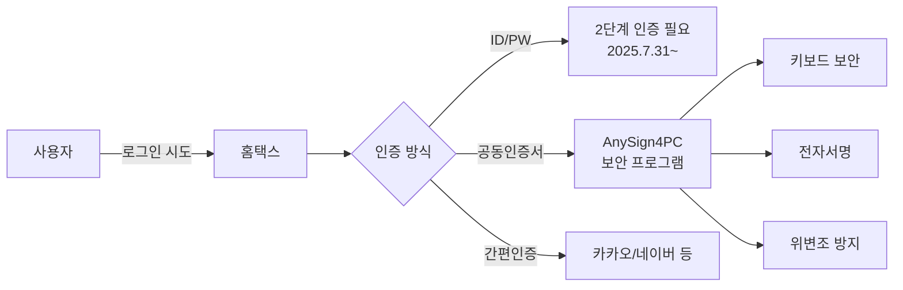
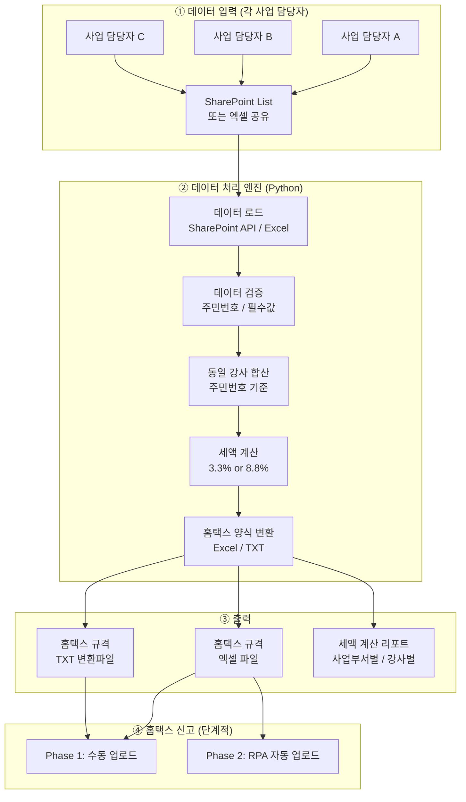
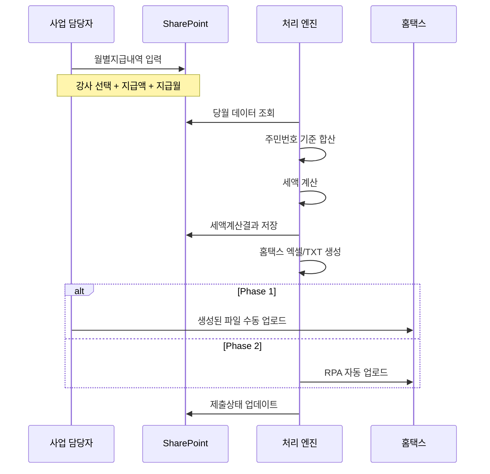

# AutoTax 시스템 도메인 리서치 & 스켈레톤 아키텍처 설계 보고서

> **작성일**: 2026-03-05  
> **프로젝트**: 대치 노인복지관 강사료 원천세 자동화 시스템  
> **목표**: 강사료 데이터 취합 → 동일 강사 합산 → 원천세 자동 계산 → 홈택스 업로드용 파일 생성 → (가능 범위 내) 자동 신고

---

## 목차

1. [홈택스 지급명세서 업로드 양식 분석](#1-홈택스-지급명세서-업로드-양식-분석)
2. [사업 담당자 필수 입력 데이터 정의](#2-사업-담당자-필수-입력-데이터-정의)
3. [세액 계산 로직 상세](#3-세액-계산-로직-상세)
4. [홈택스 자동 로그인 기술적 장벽 분석](#4-홈택스-자동-로그인-기술적-장벽-분석)
5. [전체 시스템 아키텍처](#5-전체-시스템-아키텍처)
6. [데이터베이스 구조 초안 (SharePoint List)](#6-데이터베이스-구조-초안)
7. [기술적 과제 및 극복 방안](#7-기술적-과제-및-극복-방안)

---

## 1. 홈택스 지급명세서 업로드 양식 분석

### 1.1 제출 유형 구분

복지관 강사료 원천세 신고에 관련되는 지급명세서는 **두 가지**입니다:

| 구분 | 지급명세서 종류 | 제출 주기 | 제출 기한 |
|------|---------------|----------|----------|
| **사업소득** | 간이지급명세서(거주자의 사업소득) | **매월** | 지급월 다음달 말일 |
| **기타소득** | 간이지급명세서(거주자의 기타소득) | **매월** (2024.1.1~) | 지급월 다음달 말일 |
| 사업소득(연간) | 사업소득 지급명세서 | 연 1회 | 다음해 3/10 |
| 기타소득(연간) | 기타소득 지급명세서 | 연 1회 | 다음해 3/10 |

> [!IMPORTANT]
> **2024년 1월 1일 이후 지급분부터** 인적용역 기타소득 간이지급명세서도 **매월 제출**로 변경되었습니다.
> 매월 간이지급명세서를 성실히 제출하면 연 1회 제출하는 지급명세서 의무가 면제될 수 있습니다.

### 1.2 제출 방식

홈택스에서 지급명세서 제출은 3가지 방식으로 가능합니다:

1. **직접작성 제출** – 홈택스 화면에서 1건씩 수동 입력
2. **엑셀 일괄등록 (직접작성 제출 내)** – 엑셀 서식 다운로드 → 작성 → 업로드
3. **변환파일 제출** – 회계프로그램에서 생성한 TXT 파일 업로드

> **우리 시스템이 타겟하는 방식**: **②번 엑셀 일괄등록** + **③번 변환파일 제출** 모두 지원

### 1.3 엑셀 일괄등록 양식 상세 필드

#### A. 간이지급명세서 – 사업소득 (엑셀 업로드)

| # | 컬럼명 | 데이터 형식 | 필수 | 설명 |
|---|--------|-----------|------|------|
| 1 | 주민등록번호 | `TEXT(13)` 하이픈 없이 | ✅ | 예: `8501011234567` |
| 2 | 성명 | `TEXT` | ✅ | 소득자 이름 |
| 3 | 귀속연도 | `TEXT(4)` / `NUMBER` | ✅ | 예: `2026` |
| 4 | 귀속월 | `TEXT(2)` / `NUMBER` | ✅ | 예: `01`~`12` |
| 5 | 지급월 | `TEXT(2)` / `NUMBER` | ✅ | 실제 지급한 월 |
| 6 | 업종코드 | `TEXT(6)` | ✅ | 아래 업종코드 참조 |
| 7 | 총지급액 | `NUMBER` 정수 | ✅ | 원 단위 |
| 8 | 소득세 | `NUMBER` 정수 | ✅ | 원단위 절사 |
| 9 | 지방소득세 | `NUMBER` 정수 | ✅ | 원단위 절사 |
| 10 | 외국인 여부 | `TEXT(1)` | ⬜ | 외국인:'1', 내국인:미입력 |

#### B. 간이지급명세서 – 기타소득 (엑셀 업로드)

| # | 컬럼명 | 데이터 형식 | 필수 | 설명 |
|---|--------|-----------|------|------|
| 1 | 주민등록번호 | `TEXT(13)` 하이픈 없이 | ✅ | |
| 2 | 성명 | `TEXT` | ✅ | |
| 3 | 귀속연도 | `TEXT(4)` | ✅ | |
| 4 | 귀속월 | `TEXT(2)` | ✅ | |
| 5 | 소득구분코드 | `TEXT(2)` | ✅ | 아래 소득구분 참조 |
| 6 | 지급액 | `NUMBER` | ✅ | 총 지급금액 |
| 7 | 필요경비 | `NUMBER` | ✅ | 지급액 × 60% |
| 8 | 소득금액 | `NUMBER` | ✅ | 지급액 - 필요경비 |
| 9 | 세율 | `NUMBER` | ✅ | 20 (%) |
| 10 | 소득세 | `NUMBER` | ✅ | 소득금액 × 20%, 원단위 절사 |
| 11 | 지방소득세 | `NUMBER` | ✅ | 소득세 × 10%, 원단위 절사 |

#### C. 변환파일(TXT) 레코드 구조

홈택스 변환파일 제출 시 사용하는 TXT 파일은 **A·B·C 레코드** 구조를 따릅니다:

| 레코드 | 역할 | 내용 |
|--------|------|------|
| **A레코드** | 원천징수의무자 기본사항 | 사업자번호, 법인명, 대표자명, 귀속연도, 제출연월 등 |
| **B레코드** | 소득자 개별 내역 (1인 1건) | 주민번호, 성명, 귀속월, 지급월, 업종코드, 지급액, 소득세, 지방소득세 |
| **C레코드** | 합계 레코드 | 총 인원수, 총 지급액, 총 소득세, 총 지방소득세 |

> 정확한 필드 길이와 규격은 국세청의 **"지급명세서 전산매체 제출요령"** (매년 공지) 참조 필요

### 1.4 주요 코드 체계

#### 업종코드 (사업소득용)

| 코드 | 업종명 | 적용 대상 |
|------|--------|----------|
| **940903** | 학원강사, 강사, 과외교습자 | ✅ **복지관 강사 (주요 대상)** |
| 940100 | 작가, 저술가 | 원고료 등 |
| 940909 | 기타 자영업 | 위 코드에 해당 안 되는 경우 |
| 940600 | 배우, 모델 | 공연관련 |

> [!TIP]
> **복지관 강사의 경우 `940903` 사용이 원칙**입니다.
> 940909(기타자영업)는 다른 코드로 분류 불가할 때만 사용해야 하며,
> 잘못 기재 시 고용보험 혜택 누락 등의 문제가 발생할 수 있습니다.

#### 소득구분코드 (기타소득용)

| 코드 | 소득 유형 | 적용 대상 |
|------|----------|----------|
| **76** | 일시적 인적용역 (강연료, 심사료 등) | ✅ **일회성 강의, 특강** |
| 79 | 자문/고문 활동 보수 | 자문 관련 |

---

## 2. 사업 담당자 필수 입력 데이터 정의

### 2.1 각 사업 담당자가 입력해야 할 최소 필수 항목

복지관에서 각 사업 담당자(프로그램 관리자)가 매월 입력해야 하는 데이터:

| # | 항목 | 설명 | 예시 |
|---|------|------|------|
| 1 | **담당 사업명** | 해당 프로그램 이름 | "요가교실", "서예반" |
| 2 | **강사 성명** | 강사 이름 | "홍길동" |
| 3 | **주민등록번호** | 13자리 (초기 1회 등록) | "850101-1234567" |
| 4 | **소득 구분** | 사업소득 / 기타소득 | "사업소득" |
| 5 | **지급액** | 해당 프로그램 강사료 | 500,000원 |
| 6 | **지급월** | 실제 지급하는 월 | "2026-03" |
| 7 | **수업 횟수(선택)** | 당월 수업 횟수 (참고용) | 8회 |

> [!NOTE]
> **최소화 원칙**: 주민번호·성명은 **강사 마스터 DB에 1회 등록** 후 자동 연동하여,
> 담당자는 **강사 선택 + 지급액 + 지급월**만 입력하면 되도록 설계합니다.

### 2.2 시스템이 자동 산출하는 항목

| 항목 | 산출 로직 |
|------|----------|
| 귀속연도/월 | 지급월 기준 자동 설정 |
| 업종코드 | 소득 구분 기준 자동 매핑 (사업→940903 등) |
| 동일 강사 합산 지급액 | 동일 주민번호 기준 당월 전체 합산 |
| 소득세 | 세액 계산 로직 적용 |
| 지방소득세 | 세액 계산 로직 적용 |
| 필요경비 (기타소득) | 지급액 × 60% |
| 소득금액 (기타소득) | 지급액 × 40% |

---

## 3. 세액 계산 로직 상세

### 3.1 사업소득 vs 기타소득 판단 기준

```
┌─────────────────────────────────────────────────────────────┐
│  강사의 활동이 "계속적·반복적"인가?                            │
│                                                             │
│  YES → 사업소득 (3.3%)                                      │
│    • 매월 정기적으로 강의하는 외부 강사                         │
│    • 학기 단위로 계약하여 주 1회 이상 출강                       │
│                                                             │
│  NO  → 기타소득 (8.8%)                                      │
│    • 1회성 특강, 초청 강연                                    │
│    • 비정기적 심사, 자문 등                                   │
└─────────────────────────────────────────────────────────────┘
```

### 3.2 사업소득 원천징수 계산 (3.3%)

```
총 지급액 = 동일 강사의 당월 모든 강사료 합산

소득세     = TRUNC(총지급액 × 3%, -1)    ← 원단위(10원 미만) 절사
지방소득세 = TRUNC(소득세 × 10%, -1)      ← 원단위 절사

총 원천징수 = 소득세 + 지방소득세 ≈ 3.3%
실 지급액   = 총지급액 - 총 원천징수
```

**계산 예시:**

| 항목 | 금액 |
|------|------|
| 총 지급액 | 500,000원 |
| 소득세 (3%) | 15,000원 |
| 지방소득세 (0.3%) | 1,500원 |
| **총 원천징수** | **16,500원** |
| 실 지급액 | 483,500원 |

### 3.3 기타소득 원천징수 계산 (8.8%)

```
총 지급액    = 동일 강사의 당월 모든 강사료 합산
필요경비     = 총지급액 × 60%
소득금액     = 총지급액 - 필요경비 = 총지급액 × 40%

소득세       = TRUNC(소득금액 × 20%, -1)    ← 원단위 절사
지방소득세   = TRUNC(소득세 × 10%, -1)       ← 원단위 절사

총 원천징수  = 소득세 + 지방소득세 ≈ 8.8%
```

**계산 예시:**

| 항목 | 금액 |
|------|------|
| 총 지급액 | 500,000원 |
| 필요경비 (60%) | 300,000원 |
| 소득금액 (40%) | 200,000원 |
| 소득세 (20%) | 40,000원 |
| 지방소득세 (2%) | 4,000원 |
| **총 원천징수** | **44,000원** |
| 실 지급액 | 456,000원 |

### 3.4 과세최저한 (기타소득 한정)

> **건별 기타소득금액(수입금액 - 필요경비)이 5만원 이하이면 비과세**
> → 필요경비 60% 적용 시, **총 지급액 125,000원 이하이면 소득세 0원**

```python
def calculate_other_income_tax(gross_amount):
    necessary_expense = gross_amount * 0.6
    taxable_income = gross_amount - necessary_expense  # = gross * 0.4

    # 과세최저한: 소득금액 5만원 이하 → 비과세
    if taxable_income <= 50000:
        return 0, 0, 0

    income_tax = math.trunc(taxable_income * 0.2 / 10) * 10
    local_tax = math.trunc(income_tax * 0.1 / 10) * 10

    return necessary_expense, income_tax, local_tax
```

### 3.5 동일 강사 합산 규칙

> [!IMPORTANT]
> **핵심**: 같은 달에 여러 프로그램에서 동일 강사에게 지급하는 금액은
> **주민등록번호 기준으로 합산한 후** 세액을 계산해야 합니다.
>
> 예: 강사 A가 "요가교실"에서 30만원, "필라테스"에서 20만원 수령 시
> → 합산 50만원 기준으로 세액 계산 (분리 계산 ❌)

---

## 4. 홈택스 자동 로그인 기술적 장벽 분석

### 4.1 보안 환경 개요

홈택스는 다음과 같은 보안 체계를 적용합니다:



### 4.2 기술적 장벽 상세

#### 장벽 1: 보안 프로그램 (AnySign4PC, Veraport)

| 항목 | 내용 |
|------|------|
| **문제** | AnySign4PC, 키보드보안 프로그램이 RPA의 자동 입력을 차단 |
| **증상** | `Set Text`, `Type Into` 등의 RPA 입력이 보안 프로그램에 의해 변조/차단됨 |
| **영향** | 비밀번호가 올바르게 입력되어도 "비밀번호가 틀렸다" 오류 발생 |

#### 장벽 2: 공동인증서(NPKI) 인증

| 항목 | 내용 |
|------|------|
| **경로** | `C:\Users\[사용자]\AppData\LocalLow\NPKI` |
| **암호화** | SEED 및 RSA 암호화 알고리즘 사용 |
| **도전** | 인증서 선택 팝업이 브라우저 외부 프로세스로 실행되어 Selenium/Playwright로 제어 불가 |

#### 장벽 3: ID/PW 2단계 인증

| 항목 | 내용 |
|------|------|
| **시행일** | 2025년 7월 31일부터 |
| **내용** | ID/PW 로그인 시 추가 인증(SMS, 앱 등) 필요 |
| **영향** | 단순 ID/PW 자동 입력만으로는 로그인 불가 |

#### 장벽 4: 가상환경 제한

| 항목 | 내용 |
|------|------|
| **문제** | VMware, VirtualBox, Windows Sandbox 등에서 보안 프로그램 미작동 |
| **영향** | 클라우드/컨테이너 기반 자동화 구축 불가 |

### 4.3 가능한 해결 방안

#### 방안 A: korea-pki 라이브러리 활용 (추천)

- **jc-lab/korea-pki** (GoLang/Java 오픈소스)
- ActiveX/AnySign 없이 NPKI 인증서 직접 파싱하여 전자서명
- 서버 환경에서도 동작 가능
- **한계**: 홈택스 측의 보안 정책 변경 시 대응 필요

#### 방안 B: pypinksign + 직접 HTTP 요청

- Python의 `pypinksign` 라이브러리로 인증서 직접 처리
- 브라우저 없이 HTTP 요청으로 홈택스 API 직접 호출
- **한계**: 홈택스 내부 API 규격 리버스 엔지니어링 필요, 법적 리스크

#### 방안 C: Playwright + 로컬 보안 프로그램 공존

- 실제 Windows PC에서 보안 프로그램 설치 후 Playwright로 브라우저 제어
- 인증서 비밀번호는 `pyautogui`로 네이티브 팝업에 입력
- **한계**: 키보드 보안이 pyautogui도 차단할 수 있음

#### 방안 D: 엑셀 파일 생성만 + 수동 업로드 (현실적 1차 목표)

- 시스템은 홈택스 규격 엑셀/TXT 파일만 자동 생성
- 업로드는 담당자가 홈택스에서 수동으로 진행
- **장점**: 보안 이슈 완전 회피, 즉시 구현 가능
- **RPA는 이후 2차 목표로 점진적 구현**

> [!WARNING]
> **권장 전략**: Phase 1에서는 **방안 D(파일 생성 + 수동 업로드)**를 기본으로 하고,
> Phase 2에서 **방안 C(Playwright + pyautogui)**를 실험한 뒤,
> 안정적일 경우 **방안 A(korea-pki)**로 고도화하는 단계적 접근이 현실적입니다.

### 4.4 홈택스 OpenAPI 활용 가능성

국세청 홈택스 OpenAPI는 다음 기능을 제공하지만 **지급명세서 제출 API는 미제공**:

| API | 제공 여부 | 비고 |
|-----|----------|------|
| 전자세금계산서 발행/조회 | ✅ | ASP 연동 |
| 사업자등록정보 조회 | ✅ | data.go.kr |
| 현금영수증 조회 | ✅ | |
| **지급명세서 제출** | ❌ | **API 미제공 – 웹 UI만 가능** |

> **결론**: 지급명세서 제출을 자동화하려면 웹 UI RPA 방식 외에는 방법이 없습니다.

---

## 5. 전체 시스템 아키텍처

### 5.1 시스템 흐름도



### 5.2 프로젝트 구조 (스켈레톤)

```
AutoTax/
├── main.py                     # 앱 진입점
├── requirements.txt            # 의존성
├── config.json                 # 기관 기본 설정 (사업자번호 등)
│
├── core/
│   ├── __init__.py
│   ├── data_loader.py          # SharePoint / Excel 데이터 로드
│   ├── validator.py            # 주민번호 검증, 필수값 체크
│   ├── aggregator.py           # 동일 강사 합산 (주민번호 기준)
│   ├── tax_calculator.py       # 세액 계산 엔진
│   └── hometax_formatter.py    # 홈택스 규격 파일 생성
│
├── models/
│   ├── __init__.py
│   ├── instructor.py           # 강사 데이터 모델
│   ├── payment.py              # 지급 내역 모델
│   └── tax_result.py           # 세액 계산 결과 모델
│
├── gui/
│   ├── __init__.py
│   ├── main_window.py          # 메인 대시보드
│   ├── input_view.py           # 데이터 입력/조회 화면
│   ├── result_view.py          # 세액 계산 결과 화면
│   └── settings_view.py        # 설정 화면
│
├── sharepoint/
│   ├── __init__.py
│   └── sp_connector.py         # SharePoint List CRUD
│
├── rpa/                        # Phase 2 스켈레톤
│   ├── __init__.py
│   ├── browser_controller.py   # Playwright 홈택스 제어
│   ├── cert_handler.py         # 인증서 처리
│   └── file_uploader.py        # 파일 업로드 자동화
│
├── templates/
│   ├── hometax_business_income.xlsx   # 사업소득 엑셀 템플릿
│   └── hometax_other_income.xlsx      # 기타소득 엑셀 템플릿
│
├── outputs/                    # 생성된 파일 저장
├── logs/                       # 실행 로그
└── tests/
    ├── test_tax_calculator.py
    ├── test_validator.py
    └── test_aggregator.py
```

### 5.3 기술 스택

| 레이어 | 기술 | 사유 |
|--------|------|------|
| **언어** | Python 3.11+ | 데이터 처리, 엑셀 조작, GUI 모두 가능 |
| **GUI** | CustomTkinter | 간결한 모던 데스크톱 UI |
| **엑셀 처리** | openpyxl + pandas | 읽기/쓰기/데이터 가공 |
| **SharePoint** | Office365-REST-Python-Client | SharePoint List 연동 |
| **RPA (Phase 2)** | Playwright | 모던 브라우저 자동화 |
| **인증서 (Phase 2)** | pypinksign / korea-pki | NPKI 인증서 직접 처리 |
| **암호화** | cryptography (Fernet) | 인증서 비밀번호 로컬 저장 |
| **테스트** | pytest | 단위 테스트 |

---

## 6. 데이터베이스 구조 초안

### 6.1 SharePoint List 구조

#### List 1: `강사마스터` (Instructor Master)

| 컬럼명 | 타입 | 필수 | 설명 |
|--------|------|------|------|
| ID | Auto Number | ✅ | 고유 ID |
| 성명 | Single line text | ✅ | 강사 이름 |
| 주민등록번호 | Single line text (암호화) | ✅ | 13자리 |
| 연락처 | Single line text | ⬜ | 전화번호 |
| 소득구분 | Choice | ✅ | "사업소득" / "기타소득" |
| 업종코드 | Single line text | ✅ | 기본값: "940903" |
| 소득구분코드 | Single line text | ⬜ | 기타소득 시: "76" |
| 외국인여부 | Yes/No | ⬜ | 기본값: No |
| 은행명 | Single line text | ⬜ | 이체용 |
| 계좌번호 | Single line text | ⬜ | 이체용 |
| 등록일 | Date | ✅ | 자동 |
| 비고 | Multi line text | ⬜ | 메모 |

#### List 2: `월별지급내역` (Monthly Payment)

| 컬럼명 | 타입 | 필수 | 설명 |
|--------|------|------|------|
| ID | Auto Number | ✅ | 고유 ID |
| 강사 | Lookup (강사마스터) | ✅ | 강사 선택 |
| 사업명 | Single line text | ✅ | "요가교실" 등 |
| 담당부서 | Choice | ✅ | "복지1팀", "복지2팀" 등 |
| 담당자 | Person | ✅ | SharePoint 사용자 |
| 귀속연월 | Single line text | ✅ | "2026-03" 형식 |
| 지급월 | Single line text | ✅ | "2026-03" 형식 |
| 지급액 | Number | ✅ | 원 단위 |
| 수업횟수 | Number | ⬜ | 참고용 |
| 처리상태 | Choice | ✅ | "입력완료"/"계산완료"/"제출완료" |
| 등록일시 | DateTime | ✅ | 자동 |

#### List 3: `세액계산결과` (Tax Calculation Result)

| 컬럼명 | 타입 | 필수 | 설명 |
|--------|------|------|------|
| ID | Auto Number | ✅ | 고유 ID |
| 강사 | Lookup (강사마스터) | ✅ | |
| 처리연월 | Single line text | ✅ | "2026-03" |
| 소득구분 | Choice | ✅ | "사업소득"/"기타소득" |
| 합산지급액 | Number | ✅ | 당월 합산 총액 |
| 필요경비 | Number | ⬜ | 기타소득만 |
| 소득금액 | Number | ⬜ | 기타소득만 |
| 소득세 | Number | ✅ | 계산 결과 |
| 지방소득세 | Number | ✅ | 계산 결과 |
| 총원천징수 | Number | ✅ | 소득세 + 지방소득세 |
| 실지급액 | Number | ✅ | 합산지급액 - 총원천징수 |
| 홈택스제출여부 | Yes/No | ✅ | 기본: No |
| 제출일시 | DateTime | ⬜ | 제출 시 기록 |

### 6.2 데이터 흐름



---

## 7. 기술적 과제 및 극복 방안

### 7.1 과제 우선순위 매트릭스

| # | 과제 | 난이도 | 중요도 | Phase |
|---|------|--------|--------|-------|
| 1 | 주민번호 보안 처리 (암호화 저장/전송) | 🟡 중 | 🔴 최상 | 1 |
| 2 | 동일 강사 합산 로직 정확성 | 🟢 낮 | 🔴 최상 | 1 |
| 3 | 홈택스 엑셀 양식 정확한 매핑 | 🟡 중 | 🔴 최상 | 1 |
| 4 | SharePoint List ↔ Python 연동 | 🟡 중 | 🟡 높음 | 1 |
| 5 | 원단위 절사 정확성 (세액 계산) | 🟢 낮 | 🔴 최상 | 1 |
| 6 | 과세최저한 로직 (기타소득 125,000원) | 🟢 낮 | 🟡 높음 | 1 |
| 7 | 홈택스 TXT 변환파일 레코드 규격 | 🔴 높 | 🟡 높음 | 1 |
| 8 | GUI 사용성 (비개발자 대상) | 🟡 중 | 🟡 높음 | 1 |
| 9 | 홈택스 RPA 자동 업로드 | 🔴 최고 | 🟡 중간 | 2 |
| 10 | 공동인증서 자동 로그인 | 🔴 최고 | 🟡 중간 | 2 |
| 11 | 보안 프로그램 우회/공존 | 🔴 최고 | 🟡 중간 | 2 |
| 12 | 홈택스 UI 변경 대응 | 🟡 중 | 🟡 중간 | 2+ |

### 7.2 Phase 1 핵심 과제 상세

#### 과제 1: 주민번호 보안

**문제**: 주민번호는 개인정보보호법상 암호화 저장/전송 의무가 있음

**해결 방안**:
- SharePoint에 저장 시 `cryptography` 라이브러리의 Fernet 대칭키 암호화 적용
- 프로그램 실행 중에만 복호화하여 사용
- 엑셀 파일 생성 시에만 주민번호 원문 기재 (홈택스 제출용)
- 생성된 엑셀 파일은 제출 후 즉시 삭제하도록 권고

#### 과제 3: 홈택스 엑셀 양식 정확 매핑

**문제**: 홈택스 엑셀 양식은 매년 소폭 변경될 수 있음

**해결 방안**:
- 공식 양식을 `templates/` 폴더에 저장 후 매년 업데이트
- 데이터는 양식의 정확한 셀 위치에 맞춰 삽입
- 양식 버전 관리 기능 구현

#### 과제 7: TXT 변환파일 레코드 규격

**문제**: A/B/C 레코드의 필드별 바이트 길이·패딩 규칙이 엄격함

**해결 방안**:
- 국세청 "전산매체 제출요령" 문서 기반으로 레코드 생성기 구현
- 각 필드의 정확한 바이트 수, 좌/우 정렬, 패딩 문자 등을 설정 파일화
- 테스트 케이스를 통한 형식 검증

### 7.3 Phase 2 RPA 과제 상세

#### 접근 전략 (단계적)

```
Step 1: 홈택스 로그인 없이 할 수 있는 작업 자동화
        └→ 파일 생성만 자동화 (Phase 1)

Step 2: ID/PW + 간편인증(카카오/네이버) 로그인 시도
        └→ 간편인증 팝업 → 모바일 승인 → 반자동화

Step 3: 공동인증서 로그인 자동화 시도
        └→ pypinksign으로 인증서 직접 파싱
        └→ Playwright로 브라우저 제어
        └→ pyautogui로 네이티브 팝업 처리

Step 4: 파일 업로드 자동화
        └→ 로그인 후 지급명세서 메뉴 접근
        └→ 엑셀 파일 업로드
        └→ 검증 결과 확인 → 제출 완료
```

> [!CAUTION]
> **법적 주의사항**: 홈택스 보안 프로그램을 우회하는 행위가 법적 문제가 될 수 있습니다.
> 반드시 기관 내부 감사/정보보안 담당자와 사전 협의 후 진행해야 합니다.

### 7.4 연간 일정 고려사항

| 월 | 제출 사항 | 비고 |
|----|----------|------|
| 매월 말일 | 전월 간이지급명세서 제출 | 사업소득 + 기타소득 |
| 1월 | 전년도 하반기 근로소득 간이지급명세서 | 근로소득 해당 시 |
| 3월 10일 | 전년도 사업/기타소득 지급명세서 (연간) | 간이 매월 제출 시 면제 가능 |
| 7월 10일 | 상반기 원천세 반기납부 | 반기납부 사업장만 |

---

## 부록: 원천징수의무자 기본 정보 (config.json 템플릿)

```json
{
  "organization": {
    "name": "사회복지법인 ○○ 대치노인종합복지관",
    "business_registration_number": "000-00-00000",
    "representative_name": "대표자명",
    "address": "서울특별시 강남구 ...",
    "tax_office_code": "서초세무서"
  },
  "defaults": {
    "business_income_code": "940903",
    "other_income_code": "76",
    "business_income_tax_rate": 0.03,
    "local_tax_rate": 0.1,
    "other_income_expense_rate": 0.6,
    "other_income_tax_rate": 0.2,
    "minimum_taxable_threshold": 50000
  },
  "sharepoint": {
    "site_url": "https://your-tenant.sharepoint.com/sites/AutoTax",
    "instructor_list": "강사마스터",
    "payment_list": "월별지급내역",
    "result_list": "세액계산결과"
  }
}
```

---

> **이 보고서는 Version 1.0으로, 실제 구현 시작 전 홈택스에서 최신 엑셀 양식을 다운로드하여
> 정확한 셀 위치와 필드 규격을 반드시 재확인해야 합니다.**
